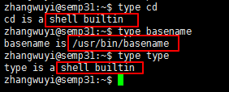

命令概述
=================

.. figure:: images/1.jpg

命令汇总

- \ `type <#typel>`_\ 
- \ `echo <#echoll>`_\ 
- \ `hash <#echol>`_\ 
- \ `export <#echol>`_\  
- \ `man <#manl>`_\ 
- \ `whatis <#whatisl>`_\ 
- \ `which <#whichl>`_\ 
- \ `whereis <#whichl>`_\ 
- \ `info <#infol>`_\   

我们将从以下几个方面来了解一下命令的基本概念

- \ `命令分类 <#cmdtype>`_\ 
- \ `命令执行 <#cmdexe>`_\ 
- \ `命令帮助 <#cmdhelp>`_\ 
- \ `命令语法 <#cmdsyntax>`_\ 

.. _cmdtype:

0x00 命令分类
~~~~~~~~~~~~~~~

在linux中命令可以分为两大类：

- \ ``内部命令(builtin command)``\ ：在bash中内部实现的命令叫做内建命令，在文件系统上没有对应的可执行文件
- \ ``外部命令(binary command)``\ ：在文件系统上的某个位置(\ ``/bin``\ 、\ ``/sbin``\ 等)有一个与命令名称对应的可执行文件

.. _typel:

我们可以通过\ ``type``\ 命令来判断命令的类型

.. _cmdexe:

0x01 命令执行
~~~~~~~~~~~~~~~

在linux中命令的执行逻辑是：

- 1.当在shell窗口输入一个命令时，shell进程会读取\ ``hash查找表``\ ，查看该表中是否缓存了输入命令对应可执行文件所在路径，如果缓存了就直接引用该路径，找到可执行文件并执行；如果没有缓存就执行第二步
- 2.shell会通过一个\ ``变量PATH``\ 设定多个路径，当用户输入命令没有在\ ``hash查找表``\ 查找到缓存信息时，shell会自动读取\ ``变量PATH的值``\ ，由左往右到这些路径查找与命令名称相同的可执行文件，然后执行；如果没有找到则会报错，说明没有该命令

.. _echoll:

.. code-block:: sh

	# 查看hash查找表:用来保存以前执行过命令对应二进制执行文件路径
	$hash

	# 查看PATH环境变量的值
	$echo $PATH   # 在shell语言中变量需要通过$来引用访问

	# 将/usr/local/docker/bin路径添加到PATH环境变量中
	$export PATH=/usr/local/docker/bin:$PATH   # 该配置只对当前shell进程有效
	# 不带任何参数的export只是输出当前shell进程的环境变量的值；如果像上述添加参数，则表示重置指定环境变量的值

.. _cmdhelp:

0x02 命令帮助
~~~~~~~~~~~~~~~

在linux终端，面对命令不知道怎么用，或不记得命令的拼写及参数时，我们需要求助于系统的帮助文档；linux系统内置的帮助文档很详细，通常能解决我们的问题，我们需要掌握如何正确的去使用它们

通常我们使用\ ``man``\ 命令来查看命令的说明文档；使用方法如下：

.. _manl:

.. code-block:: sh

	$man COMMAND           # 显示命令的man说明文档
	$man 3 COMMAND         # 显示命令的第3类man说明文档
	$man -k KeyWord        # 根据部分关键字来查询命令的说明文档；可以使用通配符

	# 当man文档中出现乱码的情况时，可以使用export LANG=en命令将语言设置为en

在man的帮助手册中，将帮助文档分为了9个类别，有的关键字可能存在多个类别中， 我们就需要指定特定的类别来查看(常用的是分类1和分类3)

- \ ``1``\ ：用户可以操作的命令或者是可执行文件
- \ ``2``\ ：系统核心可调用的函数与工具等
- \ ``3``\ ：一些常用的函数与数据库
- \ ``4``\ ：设备文件的说明
- \ ``5``\ ：设置文件或者某些文件的格式
- \ ``6``\ ：游戏
- \ ``7``\ ：惯例与协议等。例如Linux标准文件系统、网络协议、ASCⅡ，码等说明内容
- \ ``8``\ ：系统管理员可用的管理条令
- \ ``9``\ ：与内核有关的文件

man命令的执行逻辑是：从1~9段(man1,man2......)依次查找命令关键字第一次出现的帮助文档，先解压该帮助文档然后调用less命令显示帮助文档的文档内容。man文档的存放路径一般是\ ``/usr/share/man``\ 

所以man默认显示最前面的分类文档，如果一个命令有多个分类文档，我们可以通过\ ``whatis``\ 命令查看命令存在哪些分类文档。然后再通过\ ``man N COMMAND``\ 命令查看指定分类文档的信息

.. _whatisl:

.. code-block:: sh

	$whatis COMMAND            # 显示命令所处的man分类页面
	$whatis -w "ca*"           # 显示通配符匹配到的命令所处man分类页面

	# 如果whatis的数据库尚未生成，可以使用makewhatis手动生成数据库

查看man帮助文档时我们可以使用一些快捷键

- \ ``空格键``\ ：向文件尾部翻一屏
- \ ``b``\ ：向文件首部翻一屏
- \ ``回车键``\ ：向文件尾部翻一行
- \ ``k``\ ：向文件首部翻一行
- \ ``ctrl+d``\ ：向文件尾部翻半屏
- \ ``ctrl+u``\ ：向文件首部翻半屏
- \ ``1G``\ ：第一行
- \ ``G``\ ：最后一行

一般的man文档包括\ ``NAME``\ 、\ ``SYNOPSIS``\ 、\ ``OPTIONS``\ 、 \ ``EXAMPLES``\ 、\ ``DESCRIPTION``\ 几个部分。在\ ``SYNOPSIS``\ 部分有些特殊字符，它们具有特殊含义：

- \ ``[]``\ ：表示可选的部分
- \ ``{a|b}``\ ：选a或者b，但是必须选择一个
- \ ``<>``\ : 表示必不可少的部分
- \ ``...``\ : 表示同类内容可以出现多个

如果有些命令没有相关的man文档，我们还有其它查看命令帮助的方法

.. _infol:

.. code-block:: sh

	$help COMMAND          # 查看内部命令的简要说明文档
	$COMMAND --help        # 查看外部命令的简要说明文档
	$info COMMAND          # 显示命令的较详细说明文档

	# 很多应用程序都会自带文档：/usr/share/doc
	# 同样可以查看官方文档

有时我们需要查看下命令的相关路径

.. _whichl:

.. code-block:: sh

	$which COMMAND           # 查看COMMAND的binary文件所在路径
	$whereis COMMAND         # 查看COMMAND的binary文件、source文件、man帮助文档所在路径

.. _cmdsyntax:

0x03 命令语法
~~~~~~~~~~~~~~~~

参照man文档的SYNOPSIS字段，命令的格式可以写成：\ ``command options arguments``\ 

- \ ``command``\ ：命令名，可执行文件的文件名
- \ ``options``\ ：命令选项，不同选项代表不同的功能属性
	
	- 选项可以有多个，多个选项之间必须以空格分隔
	- 短选项：-char（字符）
	- 长选项：--word（单词）
	- 两个短选项可以合并，长选项一般不可以合并
	- 有些选项需要有参数
- \ ``arguments``\ ：命令参数，命令的操作对象

	- 有些命令可以带多个参数，各参数之间需要使用空格隔开

