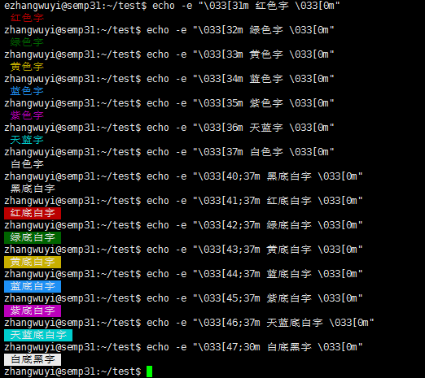
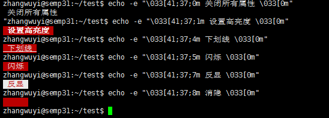

其它工具
==========

命令汇总

- \ `echo <#echol>`_\ 

.. _echol:

0x00 echo
~~~~~~~~~~~~

\ ``echo``\ 命令类似于\ ``c中printf``\ ，用于I/O标准输出

.. code-block:: sh

	$echo "hello world"   # 打印字符串

	# -e选项支持字符串内转义字符的显示输出
	$echo -e "hello\bworld"        # 删除前面的字符，输出hellworld
	$echo -e "hello\tworld"        # 制表符，输出hello	world
	$echo -e "hello\vworld"        # 垂直制表符
	$echo -e "hello\nworld"        # 换行符

	# 着色显示，字符串格式为："\033[#;#mSTRING\033[0m" 
    	# 控制符开始\033[      
    	# 第一个#表示字背景颜色，;前面的标识为背景颜色，颜色范围40—–47 
    	# ;用来分隔字背景颜色和文字颜色，如果没有表示默认背景颜色
    	# 第二个#表示文字颜色，m前面的颜色标识为文字颜色，颜色范围30—–37
    	# 控制符结束\033[0m
	$echo -e "\033[32mhello\033[0m"        # 着色显示，默认背景颜色，字颜色为32绿色
	$echo -e "\033[34m 蓝色字 \033[0m"
	$echo -e "\033[35m 紫色字 \033[0m"
	$echo -e "\033[36m 天蓝字 \033[0m"
	$echo -e "\033[37m 白色字 \033[0m"
	$echo -e "\033[40;37m 黑底白字 \033[0m"
	$echo -e "\033[41;37m 红底白字 \033[0m"
	$echo -e "\033[42;37m 绿底白字 \033[0m"
	$echo -e "\033[43;37m 黄底白字 \033[0m"
	$echo -e "\033[44;37m 蓝底白字 \033[0m"
	$echo -e "\033[45;37m 紫底白字 \033[0m"
	$echo -e "\033[46;37m 天蓝底白字 \033[0m"
	$echo -e "\033[47;30m 白底黑字 \033[0m"
	$echo -e "\033[41;37;0m 关闭所有属性 \033[0m"
	$echo -e "\033[41;37;1m 设置高亮度 \033[0m"
	$echo -e "\033[41;37;4m 下划线 \033[0m"
	$echo -e "\033[41;37;5m 闪烁 \033[0m"
	$echo -e "\033[41;37;7m 反显 \033[0m"
	$echo -e "\033[41;37;8m 消隐 \033[0m"

0x01 环境变量
~~~~~~~~~~~~~~~

.. code-block:: sh

	$export      # 显示当前shell环境变量