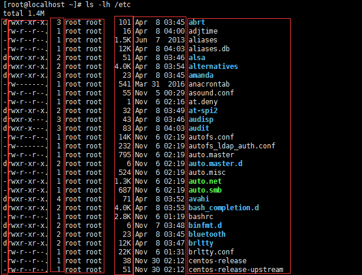
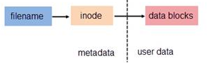
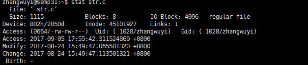
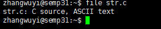
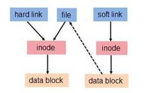
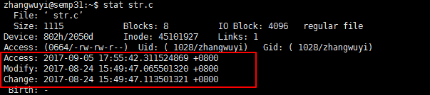

文件属性模型
==============

使用\ ``ls -l /path/to/FileName``\ 命令可以调用目录的可执行权限查看指定文件的属性模型

该属性模型依次可划分为以下几段

- \ `文件类型 <#filetype>`_\ 
- \ `文件权限模型 <#filemode>`_\ 
- \ `文件硬链接次数 <#filelink>`_\ 
- \ `文件所有者模型 <#fileowner>`_\ 
- \ `文件大小 <#filesize>`_\ 
- \ `文件时间戳 <#filetimestamp>`_\ 
- \ `文件名 <#filename>`_\ 

我们知道文件都有文件名与数据，这在Linux上被分成两个部分

- \ ``用户数据(user data)``\ ：即文件数据块(data block)，数据块是记录文件真实内容的地方，存放在磁盘的有效数据区
- \ ``元数据(metadata)``\ ：即文件的附加属性，如inode索引号，文件名，文件时间戳，权限模型，大小，类型，所有者等信息，这些信息存放在磁盘的元数据区。在Linux中，元数据中的inode号(inode是文件元数据的一部分但其并不包含文件名，inode号即索引节点号)才是文件的唯一标识而非文件名。文件名仅是为了方便人们的记忆和使用，系统或程序通过inode号寻找正确的文件数据块。其逻辑图如下所示

使用\ ``ls -l``\ 命令查看的文件所有属性都存放在文件的metadata元数据区，我们可以通过\ ``stat``\ 命令来查看一个指定文件的所有元数据属性

.. _filetype:

0x00 文件类型
~~~~~~~~~~~~~~~

linux中一切皆文件，其文件类型有：

.. csv-table::
	:header: 文件类型, 标识符, 相关说明
	:widths: 10, 5, 15

	\ `普通文件 <#file>`_\ , -/f, 文本文件
	\ `目录文件 <#dir>`_\ , d, 路径映射
	\ `硬链接文件 <#symbol>`_\ , -/d/f, 文件名别名 
	\ `软链接文件 <#soft>`_\ , l, 快捷方式
	\ `字符设备文件 <#device>`_\ , c, 线性串行设备
	\ `块设备文件 <#device>`_\ , b, 随机并行设备
	命名管道文件, p/fi/fo, 实现本机进程间通信
	套接字文件, s, 实现跨机进程间通信

我们可以通过\ ``file``\ 命令查看指定文件的文件类型

.. _file:

普通文件基本上都是文本文件，在磁盘块中存放的是文本内容

.. _dir:

目录文件是一种特殊的文件，它是一种\ **路径映射**\ 。它在磁盘块中存放的是该目录下所有文件的文件名以及对应inode号构成的索引表。系统就是通过该路径映射找到文本文件并对其进行读写操作

.. _sslink:

linux的文件系统是一种遵循\ ``FHS标准``\ 的层次化根文件系统,每次操作文件时都需要从根开始进行索引查找，这大大降低了系统文件访问效率。为了提高效率就出现了\ ``buffer缓冲元数据``\ 和\ ``cache缓存文本数据``\ 。除此之外为两个文件之间建立链接也是一种提高文件访问效率的方法。链接为Linux 系统解决了文件的共享使用，还带来了隐藏文件路径、增加权限安全及节省存储等好处

.. _symbol:

硬链接文件具有以下特点：

- 硬链接文件和源文件不能跨分区，跨文件系统
- 硬链接文件和源文件是指向同一个inode的不同文件名，即硬链接文件是源文件的一个别名
- 不能对目录创建硬链接，避免循环引用
- 硬链接需要对文件本身进行引用，所以它会改变源文件被链接的次数

.. _soft:

软链接文件也可叫做符号链接,具有以下特点：

- 符号链接文件和源文件是可以跨分区
- 符号链接文件和源文件是指向不同inode的不同文件名，可以理解为快捷方式
- 符号链接文件的inode号对应的用户数据块存放的内容是被链接源文件的路径(即源文件文件名)，使用\ ``ls -l``\ 命令显示的符号链接的大小指的是路径字符串的长度
- 可以对目录创建符号链接
- 符号链接只是引用文件路径，不会对文件本身进行引用，所以它不会改变源文件被链接的次数

硬链接和软链接的访问机制如图所示

关于硬链接和软链接的详解可参考\ `理解Linux的硬链接与软链接 <https://www.ibm.com/developerworks/cn/linux/l-cn-hardandsymb-links/index.html>`_\ 

.. _device:

连接到系统上的设备都会被内核通过设备驱动识别并映射成\ ``/dev``\ 目录下的一个设备文件，通过该设备文件对设备进行访问等操作。设备文件可以分为：

- \ **字符设备**\ ：它是线性串行设备，遵循时序逻辑，一次存取一个字符，例如：键盘等
- \ **块设备**\ ：它是随机并行设备，不遵循时序，多线程进行，例如：硬盘等

.. _filemode:

0x01 文件权限模型
~~~~~~~~~~~~~~~~~

权限模型是用来实现系统资源的分配，该模型的基本思想就是在文件系统的基础上为每一个文件标注其所有者及其访问权限。权限模型的作用对象是文件

.. _filelink:

0x02 文件硬链接次数
~~~~~~~~~~~~~~~~~~~~

关于文件硬链接次数可参考\ `链接文件 <#sslink>`_\ 

也可参考\ `理解Linux的硬链接与软链接 <https://www.ibm.com/developerworks/cn/linux/l-cn-hardandsymb-links/index.html>`_\ 

.. _fileowner:

0x03 文件所有者模型
~~~~~~~~~~~~~~~~~~~~~

.. _filesize:

0x04 文件大小
~~~~~~~~~~~~~~~

ls命令默认显示的文件大小的单位都是字节，当文件过大时不便于人们读取；我们在使用ls命令时可以加上\ ``-h``\ 选项将文件大小转换为人们易于理解阅读的方式：文件大小以\ **M**\ 、\ **G**\ 的方式显示，没有后缀的是以B字节为单位的

.. _filetimestamp:

0x05 文件时间戳
~~~~~~~~~~~~~~~~~~

一个文件的元数据区中存放文件的三种时间戳

- \ ``access time(atime)``\ ：访问时间
- \ ``modify time(mtime)``\ ：修改时间(修改\ ``用户数据(user data)``\ 的时间)
- \ ``change time(ctime)``\ ：改变时间(修改\ ``元数据(metadata)``\ 的时间)

我们可以通过\ ``stat``\ 命令查看这三种时间戳

ls命令显示的文件时间戳只是文件的\ **ctime改变时间**\ 

.. _filename:

0x06 文件名
~~~~~~~~~~~~~
ls命令默认不能显示以\ ``.``\ 开头的文件，这些文件被称为隐藏文件，如果想要查看这类文件，需要在使用ls命令时加上\ ``-a``\ 选项 

0x07 命令汇总
~~~~~~~~~~~~~~
- ls
- stat
- file