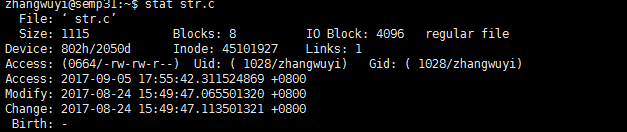
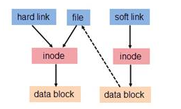
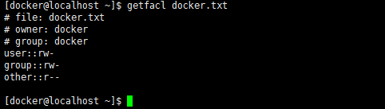
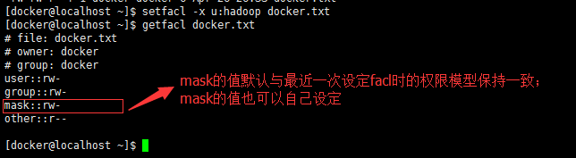

文件属性模型
==============

命令汇总：

- \ `ls <#lsl>`_\ 
- \ `stat <#statl>`_\ 
- \ `file <#filel>`_\ 
- \ `chown <#chownl>`_\ 
- \ `chgrp <#chgrpl>`_\ 
- \ `uamsk <#umaskl>`_\ 
- \ `chmod <#chmodl>`_\ 
- \ `getfacl <#getfacll>`_\ 
- \ `setfacl <#setfacll>`_\ 

.. _lsl:

使用\ ``ls -l /path/to/FileName``\ 命令可以调用目录的可执行权限查看指定文件的属性模型

.. figure:: ../images/1.png

\ ``ls``\ 命令还有其它选项：

.. code-block:: sh

	$ls -t       # 按照时间戳排序显示文件
	$ls -rt      # 按照时间戳逆序显示文件

该属性模型依次可划分为以下几段

- \ `文件类型 <#filetype>`_\ 
- \ `文件权限模型 <#filemode>`_\ 
- \ `文件硬链接次数 <#filelink>`_\ 
- \ `文件所有者模型 <#fileowner>`_\ 
- \ `文件大小 <#filesize>`_\ 
- \ `文件时间戳 <#filetimestamp>`_\ 
- \ `文件名 <#filename>`_\ 

我们知道文件都有文件名与数据，这在Linux上被分成两个部分

- \ ``用户数据(user data)``\ ：即文件数据块(data block)，数据块是记录文件真实内容的地方，存放在磁盘的有效数据区
- \ ``元数据(metadata)``\ ：即文件的附加属性，如inode索引号，文件名，文件时间戳，权限模型，大小，类型，所有者等信息，这些信息存放在磁盘的元数据区。在Linux中，元数据中的inode号(inode是文件元数据的一部分但其并不包含文件名，inode号即索引节点号)才是文件的唯一标识而非文件名。文件名仅是为了方便人们的记忆和使用，系统或程序通过inode号寻找正确的文件数据块。当磁盘块对应的inode没有被任何一个文件名引用(即硬链接数为0)，系统认为该磁盘块处于未使用空闲状态，将会标记该磁盘块为空闲从而回收该磁盘空间。其逻辑图如下所示

.. figure:: ../images/2.png

电脑能够识别的是数字，存储在元数据区的不是文件名而是索引结点号\ ``index node``\ ；计算机通过\ ``名称解析(name resoling)``\ 将识别的索引结点号解析成人类易读的文件名；将文件名转化成索引号存储，便于计算机识别。

.. _statl:

使用\ ``ls -l``\ 命令查看的文件所有属性都存放在文件的metadata元数据区，我们可以通过\ ``stat``\ 命令来查看一个指定文件的所有元数据属性

.. _filetype:

0x00 文件类型
~~~~~~~~~~~~~~~

linux中一切皆文件，其文件类型有：

.. csv-table::
	:header: 文件类型, 标识符, 相关说明
	:widths: 10, 5, 15

	\ `普通文件 <#pfile>`_\ , -/f, 文本文件
	\ `目录文件 <#dir>`_\ , d, 路径映射
	\ `硬链接文件 <#symbol>`_\ , -/d/f, 文件名别名 
	\ `软链接文件 <#soft>`_\ , l, 快捷方式
	\ `字符设备文件 <#device>`_\ , c, 线性串行设备
	\ `块设备文件 <#device>`_\ , b, 随机并行设备
	命名管道文件, p/fi/fo, 实现本机进程间通信
	套接字文件, s, 实现跨机进程间通信

.. _filel:

我们可以通过\ ``file``\ 命令查看指定文件的文件类型

.. figure:: ../images/6.png

.. _pfile:

普通文件基本上都是文本文件，在磁盘块中存放的是文本内容

.. _dir:

目录文件是一种特殊的文件，它是一种\ **路径映射**\ 。它在磁盘块中存放的数据是该目录下所有文件的文件名以及对应inode号构成的索引表。系统就是通过该路径映射找到文本文件并对其进行读写操作

.. _sslink:

linux的文件系统是一种遵循\ ``FHS标准``\ 的层次化根文件系统,每次操作文件时都需要从根开始进行索引查找，这大大降低了系统文件访问效率。为了提高效率就出现了\ ``buffer缓冲元数据``\ 和\ ``cache缓存文本数据``\ 。除此之外为两个文件之间建立链接也是一种提高文件访问效率的方法。链接为Linux 系统解决了文件的共享使用，还带来了隐藏文件路径、增加权限安全及节省存储等好处

.. _symbol:

硬链接文件具有以下特点：

- 硬链接文件和源文件不能跨分区，跨文件系统
- 硬链接文件和源文件是指向同一个inode的不同文件名，即硬链接文件是源文件的一个别名
- 不能对目录创建硬链接，避免循环引用
- 硬链接需要对文件本身进行引用，所以它会改变源文件被链接的次数

.. _soft:

软链接文件也可叫做符号链接,具有以下特点：

- 符号链接文件和源文件是可以跨分区
- 符号链接文件和源文件是指向不同inode的不同文件名，可以理解为快捷方式
- 符号链接文件的inode号对应的用户数据块存放的内容是被链接源文件的路径(即源文件文件名)，使用\ ``ls -l``\ 命令显示的符号链接的大小指的是路径字符串的长度
- 可以对目录创建符号链接
- 符号链接只是引用文件路径，不会对文件本身进行引用，所以它不会改变源文件被链接的次数

硬链接和软链接的访问机制如图所示

删除软链接不会对源文件造成影响，因为它删除的只是源文件的路径映射；但是如果删除的硬链接是最后一个，那么对应的inode区就没有文件名引用，inode对应的磁盘空间将会被回收

关于硬链接和软链接的详解可参考\ `理解Linux的硬链接与软链接 <https://www.ibm.com/developerworks/cn/linux/l-cn-hardandsymb-links/index.html>`_\ 

.. _device:

连接到系统上的设备都会被内核通过设备驱动识别并映射成\ ``/dev``\ 目录下的一个设备文件，通过该设备文件对设备进行访问等操作。设备文件可以分为：

- \ **字符设备**\ ：它是线性串行设备，遵循时序逻辑，一次存取一个字符，例如：键盘等
- \ **块设备**\ ：它是随机并行设备，不遵循时序，多线程进行，例如：硬盘等

.. _filemode:

0x01 文件权限模型
~~~~~~~~~~~~~~~~~

权限模型是用来实现系统资源的分配，该模型的基本思想就是在文件系统的基础上为每一个文件标注其所有者及其访问权限。权限模型的作用对象是文件

创建文件后，\ `所有者模型 <#fileowner>`_\ 中的每类用户都会有自己的\ ``rwx权限模型``\ 

\ ``ls -l``\ 命令显示结果\ ``rwxr-xr-x``\ 

- 前三位\ ``rwx``\ 对应文件所有者owner属主的权限
- 中间三位\ ``r-x``\ 对应文件所有者group属组的权限
- 最后三位\ ``r-x``\ 对应文件所有者other其它用户的权限

由此可将权限模型抽象成：\ ``rwx``\

- 对文件而言

	- \ **r(read)**\ ：可以使用内容查看类的命令来显示其相关内容
	- \ **w(write)**\ ：可以使用编辑器修改其内容
	- \ **x(execute)**\ ：可以将其发起一个进程
- 对目录而言 

	- \ **r(read)**\ ：可以使用\ ``ls``\ 命令查看目录内的文件信息
	- \ **w(write)**\ ：可以创建、删除文件
	- \ **x(execute)**\ ：可以使用\ ``ls -l``\ 命令来查看目录内容的文件信息，并且可以使用\ ``cd``\ 命令切换此目录为工作目录

需要注意的是：

- 用户不拥有某位权限，则使用\ ``-``\ 占位：\ ``r-x``\ 表示读和执行的权限、\ ``r--``\ 表示只读权限、\ ``rw-``\ 表示读写权限
- \ ``rwx``\ 权限模型可以使用8机制来表示：\ ``r:4``\ 、\ ``w:2``\ 、\ ``x:1``\ 、\ ``-:0``\ 

	 - \ ``r-x``\ 可以用\ ``5``\ 来表示
	 - \ ``rw-``\ 可以用\ ``6``\ 来表示
	 - \ ``rwxr-xr-x``\ 可以用\ ``755``\ 来表示
- 所有链接文件的权限都是\ ``777``\ 并且无法被改动

通常我们在创建一个文件时，并没有特意去指定文件的权限模型，但是创建好的文件同样拥有自己的权限模型，这是因为\ ``umask机制``\ ：

- 创建普通文件时文件的默认权限模型是\ ``666-umask``\ 确保普通文件默认不允许出现执行权限，如果出现则在八进制的基础上加1
- 创建目录文件时目录的默认权限模型是\ ``777-umask``\ 确保目录文件默认应该具有执行权限，如果没有执行权限也可以
- 创建链接文件时链接文件的默认权限都是\ ``777``\ 并且无法被改动

不同情况下umask的值是不一样的：

- root用户的\ ``umask=0022``\ 
- 普通用户如果用户名和基本组名一致则\ ``umask=0002``\ ，否则\ ``umask=0022``\ 

.. _umaskl:

uamsk的值可以通过\ ``umask``\ 命令指定数值进行修改，但是此次修改只对当前进程有效，要想永久有效，需要放在配置文件中

.. code-block:: sh

	# 查看umask的值
	$umask

	# 设置umask的值
	$umask 0023

.. _chmodl:

对于已经创建好的文件，我们可以通过\ ``chmod``\ 命令来修改文件的权限模型

.. code-block:: sh

	# 方法一：使用八进制的形式一次性操作三类用户的权限
	$chmod 770 ./1.txt
	$chmod -R 6 /u       # 当八进制权限模型不足时，默认以0补全，即006；递归修改目录以及子文件的权限模型

	# 方法二：基于+/=/-，使用x/w/r，来操作指定用户(u,g,o,a)的权限
	$chmod u=rx /u   # 属主的权限是r-x；如果是u=，则表示没有权限
	$chmod g-x /u    # 属组去掉x权限
	$chmod o+w /u    # 其它用户添加w权限
	$chmod a+r /u    # 所有用户添加r权限，此时可以直接写成+r
	$chmod -R u+x,g=,o= /u # 同时指定多个用户权限时使用逗号隔开；递归修改目录以及子文件的权限模型

	# 方法三：参照其他文件的权限模型修改当前文件权限模型
	$chmod --reference=./2.txt /u
	$chmod -R --reference=./2.txt /u  # 递归修改目录以及子文件的权限模型

接下来我们来说下权限模型的访问应用法则：

- 当用户发起一个进程访问一个文件时，首先来判定发起进程的用户跟文件的属主是否一致，如果一致则应用文件属主的权限；
- 如果不是，则判定用户所属属组中的一个（基本组或者附加组）跟文件的属组是否一致，一致则应用文件属组的权限；
- 如果不是，则应用其他用户的权限

上述所说的权限只是基本权限模型，在linux中存在以下特殊权限模型

- \ ``suid``\ ：任何用户执行可执行文件发起进程时，不再以用户自己的身份当作进程的属主，而是以可执行文件文件的属主当作进程的属主

	- suid表现为可执行文件属主权限执行位上的\ ``s(x)``\ 或\ ``S(-)``\ 
	- suid只对可执行文件有意义
- \ ``sgid``\ ：具有sgid的目录，用户在此创建文件时，新建文件的属组不再是用户的基本组，而是目录的属组

	- sgid表现为目录文件属组权限执行位上的\ ``s(x)``\ 或\ ``S(-)``\ 
	- sgid只对目录文件有意义
- \ ``sticky``\ ：对于公共可写的目录，用户可创建文件，可以删除自己的文件，但无法删除别的用户的文件,该机制为sticky粘滞位

	- sticky表现为目录文件其他用户权限执行位上\ ``t(x)``\ 或\ ``T(-)``\ 
	- sticky只对目录文件有意义

\ ``suid、sgid、sticky``\ 刚好可以类似于\ ``r、w、x``\ 组成一个三位8进制的特殊权限：

	- suid为4
	- sgid为2
	- sticky为1

我们同样可以通过\ ``chmod``\ 命令来修改特殊权限模型

.. code-block:: sh

	# 方法一：使用八进制的形式一次性操作所有特殊权限位
	$chmod 4554 /u  # 假设可执行文件原来的权限为455；给可执行文件属主添加suid权限
	$chmod 2552 /u  # 假设目录文件原来的权限为255；给目录文件属组添加sgid权限
	$chmod 1551 /u  # 假设目录文件原来的权限为155；给目录文件其它用户添加sticky权限

	# 方法二：基于+/-，使用s/t，来操作指定用户(u,g,o)的权限
	$chmod u+s /u  # 给可执行文件属主添加suid权限
	$chmod g+s /u  # 给目录文件属组添加sgid权限
	$chmod o+t /u  # 给目录文件其它用户添加sticky权限

除了基本权限模型和特殊权限模型外，linux中还存在另外一种权限模型：\ ``访问控制列表facl``\ 

- 普通用户无法安全地将某文件授权给其他用户访问，此时我们在文件原有权限模型之上附加另一层权限控制机制，保存至文件扩展属性信息中，使普通用户能够安全的将自己的文件授权给指定用户进行访问等操作
- 它表现为9位基本权限模型后面的\ ``+``\ 号，一旦使用\ ``ls -l``\ 命令查看文件权限模型中出现\ ``+``\ 号说明该文件具有额外的\ ``访问控制列表facl``\ 权限
- facl适用于普通用户指定权限

.. _getfacll:

我们可以通过\ ``getfacl``\ 命令查看指定文件的访问控制列表，其输出格式为

- \ ``user::rw-``\ ：冒号将该字段分为3段，即用户、用户名、对应权限。空格表示该文件的属主
- \ ``group::rw-``\ ：冒号将该字段分为3段，即组、组名、对应权限。空格表示该文件的属组
- \ ``other::r--``\ ：冒号将该字段分为3段，即其他用户、用户名、对应权限。空格表示该文件的其他用户

.. _setfacll:

上图是没有设定facl时文件的原有权限模型，我们可以通过\ ``setfacl``\ 命令来设定和取消文件的facl

.. code-block:: sh

	# 设定facl权限
	$setfacl -m u:hadoop:rw- /u  # 设定文件指定用户的权限模型
	$setfacl -m g:hadoop:rw- /u  # 设定文件指定组的权限模型
	$setfacl -m m::rw- /u        # 设定文件的mask权限模型

	# 取消facl权限
	$setfacl -x u:hadoop /u  # 取消文件指定用户的权限模型
	$setfacl -x g:hadoop /u  # 取消文件指定组的权限模型
	$setfacl -x m: /u        # 取消文件的mask权限模型

	#注意
	#1、指定用户和组的真正权限模型是设定值与mask值相与的结果
	#2、使用setfacl命令设定facl时只对当前文件有效；如果当前文件是目录文件，且想对目录中的文件也设定facl，则需要使用-R选项实现递归设定facl

.. figure:: ../images/8.png

类似于基本权限模型，访问控制列表facl的应用法则是：

- 先匹配原始用户与文件属主
- 然后匹配facl设定的用户与文件属主
- 然后匹配原始属组与文件属组
- 然后匹配facl设定的属组与文件属组
- 最后匹配原始其他用户与文件其他用户

.. _filelink:

0x02 文件硬链接次数
~~~~~~~~~~~~~~~~~~~~

关于文件硬链接次数可参考\ `链接文件 <#sslink>`_\ 

也可参考\ `理解Linux的硬链接与软链接 <https://www.ibm.com/developerworks/cn/linux/l-cn-hardandsymb-links/index.html>`_\ 

.. _fileowner:

0x03 文件所有者模型
~~~~~~~~~~~~~~~~~~~~~
文件的所有者模型的本质就是用户模型，在linux中用户可分为\ ``owner属主用户``\ 、\ ``group属组用户``\ 、\ ``other其它用户``\ ，它们具有以下特点：

- 属主可以属于基本组或附加组，属组包含属主
- other用户是除group组内所有用户之外的其它所有用户
- 每类用户都有其对应的权限模型

每个文件都有其对应的属主和属组，当我们创建文件时，系统会默认将当前用户作为文件的属主，将当前用户的基本组或者附加组作为该文件的属组

我们可以通过\ ``chown``\ 和\ ``chgrp``\ 命令来修改文件的属主和属组属性

.. _chownl:

\ ``chown``\ 可以修改文件的属主和属组

.. code-block:: shell

	# 将文件的属主改为root
	$chown root ./1.txt

	# 将文件的属主改为root、属组改为staff
	$chown root:staff ./1.txt

	# 将文件的属组改为staff
	$chown :staff ./1.txt
	$chown .staff ./1.txt

	# 按照参考文件的所有者模型修改指定文件的所有者模型
	$chown --reference=./2.txt ./1.txt

	# 当改变一个目录的属主或属组时，默认是不会改变内部文件的属主或属组
	# 如果要想改变其内部文件可以使用-R选择，实现递归改变内部文件的属主或属组
	$chown -R root /u

.. _chgrpl:

\ ``chgrp``\ 用来修改文件的属组

.. code-block:: sh

	# 修改文件的属组为staff
	$chgrp staff ./1.txt

	# 将目录以及其子文件的属组都修改为staff
	$chgrp -R staff /u

	# 按照参考文件的所有者模型修改指定文件的所有者模型
	$chgrp -R --reference=./2.txt /u

.. _filesize:

0x04 文件大小
~~~~~~~~~~~~~~~

ls命令默认显示的文件大小的单位都是字节，当文件过大时不便于人们读取；我们在使用ls命令时可以加上\ ``-h``\ 选项将文件大小转换为人们易于理解阅读的方式：文件大小以\ **M**\ 、\ **G**\ 的方式显示，没有后缀的是以B字节为单位的

.. _filetimestamp:

0x05 文件时间戳
~~~~~~~~~~~~~~~~~~

一个文件的元数据区中存放文件的三种时间戳

- \ ``access time(atime)``\ ：访问时间
- \ ``modify time(mtime)``\ ：修改时间(修改\ ``用户数据(user data)``\ 的时间)
- \ ``change time(ctime)``\ ：改变时间(修改\ ``元数据(metadata)``\ 的时间)

我们可以通过\ ``stat``\ 命令查看这三种时间戳

.. figure:: ../images/5.png

ls命令显示的文件时间戳只是文件的\ **ctime改变时间**\ 

.. _filename:

0x06 文件名
~~~~~~~~~~~~~
ls命令默认不能显示以\ ``.``\ 开头的文件，这些文件被称为隐藏文件，如果想要查看这类文件，需要在使用ls命令时加上\ ``-a``\ 选项 
