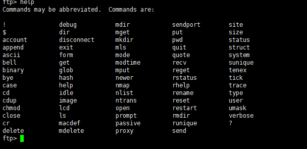
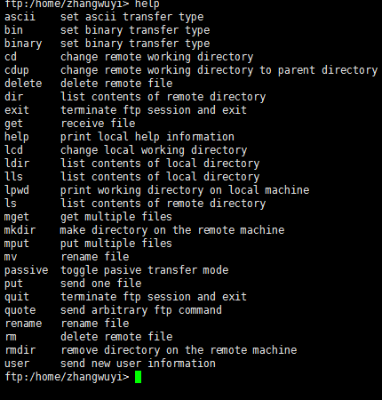

ftp服务器
==========

参考文档

- \ `CentOS下vsftp设置 <http://desert3.iteye.com/blog/1685734>`_\ 
- \ `针对CentOS的SELinux拦截vsftpd问题 <https://blog.csdn.net/programer_bei/article/details/52333586>`_\ 

\ ``ftp服务器``\ 的主要功能就是：文件的上传和下载

\ ``ftp服务器的搭建``\ 我们这里选择使用\ ``vsftpd``\ 工具

其搭建基本流程是：

- \ `vsftpd工具安装 <#vsftpdl>`_\ 

	- \ `Ubuntu系列安装 <#ftpubuntu>`_\ 
	- \ `CentOS系列安装 <#ftpcentos>`_\ 
- \ `服务端配置 <#ftpserver>`_\ 

	- \ `修改配置文件 <#ftpconf>`_\
	- \ `重启服务 <#ftpres>`_
- \ `客户端登陆 <#ftpclient>`_\ 

	- \ `ftp客户端访问 <#ftpu>`_\ 
	- \ `lftp客户端访问 <#ftpr>`_\ 
- \ `连接操作 <#ftpoperation>`_\ 

	- \ `ftp客户端操作 <#ftpopera>`_\ 
	- \ `lftp客户端操作 <#lftpopera>`_\ 

.. _vsftpdl: 

0x00 vsftpd工具安装
~~~~~~~~~~~~~~~~~~~~~

不同linux发行版的安装方式不同

.. _ftpubuntu: 

Debian/Ubuntu系列安装方式

.. code-block:: sh

	# apt-get安装
	$sudo apt-get install vsftpd

.. _ftpcentos: 

RedHat/Fedra/CentOs系列安装方式

.. code-block:: sh
	
	# yum安装
	$yum install vsftpd

.. _ftpserver: 

0x01 服务端配置
~~~~~~~~~~~~~~~~~

.. _ftpconf:

安装好\ ``vsftpd``\ 工具之后，我们需要修改下配置文件，但是我们怎么知道配置在哪呢，如果熟悉linux的人就会知道配置文件肯定在\ ``/etc``\ 目录下，但是该目录那么多配置文件我该怎么找呢？此时我们有几种方式可以帮你找到其配置文件

.. code-block:: sh

	$ rpm -ql vsftpd | grep etc   # 获取vsftpd工具配置文件的安装路径
	$ whereis vsftpd              # 获取vsftpd工具配置文件的安装路径

通过上述命令我们可以得知，其配置文件路径是：\ ``/etc/vsftpd/vsftpd.conf``\ ，通过\ ``vi/vim``\ 编辑器打开，具体修改内容如下：

.. figure:: ../images/1.png

.. _ftpres: 

配置文件修改完之后，需要重启服务使其配置文件生效

.. code-block:: sh

	# Systemv格式重启服务
	$service vsftpd restart           # CentOS系列重启
	$sudo service vsftpd restart      # Ubuntu系列重启

	# Systemd格式重启服务
	$systemctl restart vsftpd.service       # CentOS系列重启
	$sudo systemctl restart vsftpd.service  # Ubuntu系列重启

最后使用\ ``netstat -pantu | grep vsftpd``\ 命令查看服务是否启动成功，处于监听状态

.. figure:: ../images/2.png

.. _ftpclient:

0x02 客户端登陆
~~~~~~~~~~~~~~~~~~

.. _ftpu:

使用ftp客户端登陆之前，我们需要安装ftp客户端

- linux端

	- \ ``yum install ftp``\ 
	- \ ``sudo apt-get install ftp``\ 

- windows端

	- \ ``Xmanage-Xshell``\ 
	- \ ``Securecrt``\ 

安装好客户端后就可以使用ftp客户端登陆了，登陆方式有：

- 实名用户登陆
- 匿名用户登陆

实名用户登陆(登陆默认进入登陆用户的家目录):

.. code-block:: sh

	# linux下使用ftp登陆
	$ftp 192.168.80.128        # 然后输入用户名和密码即可

	# windows下xshell登陆
	$ftp zwy@192.168.80.128    # zwy是要登陆的用户，然后输入密码即可

注意：有些用户可能不具有ftp的权限，这些用户会存在于\ ``/etc/vsftpd/ftpusers`` 和\ ``/etc/vsftpd/user_list``\ 文件中。如果想让这些用户可以ftp登陆，则需要将其在这两个文件删除或注释掉即可

.. figure:: ../images/3.png

实名登陆有诸多弊端：

- 暴露用户名和密码
- 实名用户登陆后可以在任意目录下来回切换，不太安全

所以一般我们都不使用实名用户登陆，而是使用匿名用户进行登陆

匿名用户登陆后，是不允许匿名用户在任意目录下直接来回切换，只能在一个指定目录范围内工作，所以需要在ftp服务器上创建一个匿名用户的家目录，该目录就是匿名用户的根目录

匿名用户是以ftp用户登陆的(默认无密码)，所以默认匿名用户的家目录就是ftp用户的家目录，此时我们可以通过\ ``cat /etc/passwd | grep ftp``\ 命令找到ftp用户的家目录，也就是匿名用户的家目录

然后使用下列方法实现匿名用户登陆

.. code-block:: sh

	# linux下使用ftp登陆
	$ftp 192.168.80.128        # 然后输入用户名anonymous和密码，密码直接回车即可

	# windows下xshell登陆
	$ftp anonymous@192.168.80.128    # anonymous是匿名用户，然后输入密码，密码直接回车即可

除了可以使用默认ftp家目录作为匿名用户根目录，还可以自己设定

- 使用\ ``mkdir anonyFtp``\ 命令在指定目录下创建一个目录，即为匿名用户的家目录
- 在\ ``vsftpd.conf``\ 配置文件中通过\ `` anon_root=/home/anonyFtp``\ 设定该目录为匿名用户的登陆根目录
- \ ``anonyFtp``\ 目录的所有者模型可以使用默认的\ ``owner``\ 、\ ``group``\ 所有者，但是权限模型最好设置为777，即\ ``chmod 777 anonyFtp``\ 。此时owner和group都不是ftp

	- 如果要保证匿名用户能够登陆，必须保证\ ``others所有者权限位+x``\ 
	- 如果要保证能够列出根目录下所有文件内容，必须保证\ ``others所有者权限位+r``\ 
	- 如果要保证能够在根目录上上传文件，必须保证\ ``others所有者权限位+w``\ 
- 如果要保证\ ``anonyFtp``\ 根目录下所有子目录能否切换、上传、下载，设置方法如下，这样可以保证ftp用户有可执行x权限

	- \ ``chown ftp:ftp anonyFtp/pub``\ ：将pub目录的owner和group都设置为ftp，因为匿名用户是以ftp用户登陆的
	- \ ``chmod 744 anonyFtp/pub``\     
- vsftpd默认被CentOS的防火墙组件SELinux拦截，造成vsftpd没有足够的权限，有两种解决方法

	- 直接关闭SELinux，这样不太安全

		- \ ``setenforce 0``\  ：暂时让SELinux进入Permissive模式，关闭SELinux，但是重启失效
		- 将\ ``/etc/selinux/config``\ 文件中的\ ``SELINUX=enforcing``\ 改成\ ``SELINUX=permissive``\ ,然后重读该配置文件，重启也生效
	- 不需要关闭SELinux就能使vsftpd具有访问ftp根目录，以及文件传输等权限

		- \ ``getsebool -a | grep ftpd``\ ：查看与ftpd相关的权限信息，off是关闭权限，on是打开权限
		- \ ``setsebool -P ftpd_anon_write 1``\ ：打开ftpd_anon_write权限，重启生效
		- \ ``setsebool -P allow_ftpd_full_access 1``\ ：打开allow_ftpd_full_access权限，重启生效
- 最后重启服务

.. _ftpr: 

使用lftp客户端登陆之前，我们需要安装lftp客户端

- linux端

	- \ ``yum install lftp``\ 
	- \ ``sudo apt-get install lftp``\ 

安装好客户端后就可以使用lftp客户端登陆了，登陆方式同样也有：

- 实名用户登陆
- 匿名用户登陆

匿名用户登陆步骤：

- \ ``lftp 192.168.80.128``\ ，回车
- 输入\ ``login``\ ，回车

如果使用匿名用户登陆后\ ``ls``\ 出现如下错误提示：\ ``refusing to run with writable root inside chroot()``\ ，是因为默认配置中不允许根目录可写，有两种解决方法：

- 方法一：\ ``chmod o-w anonyFtp``\ ：去掉根目录的可写权限
- 方法二：在\ ``/etc/vsftpd/vsftpd.conf``\ 配置文件中，添加\ ``allow_writeable_chroot=YES``\ 字段

实名用户登陆步骤：

- \ ``lftp test@192.168.80.128``\ ，回车
- 输入密码回车

.. _ftpoperation: 

0x03 连接操作
~~~~~~~~~~~~~~

.. _ftpopera: 

ftp客户端登陆后输入\ ``help``\ 即可查看ftp支持的所有操作命令

linux中ftp工具支持的操作

windows中xshell工具支持的操作

\ **注意**\ ：ftp客户端不能直接操作目录，如果要上传下载目录，需要先将其打包压缩成一个文件

.. _lftpopera: 

lftp客户端登陆后输入\ ``help``\ 即可查看lftp支持的所有操作命令

.. figure:: ../images/6.png

其中常用操作有：

- \ ``put``\ ：上传文件
- \ ``mput``\ ：上传多个文件
- \ ``get``\ ：下载文件
- \ ``mget``\ ：下载多个文件
- \ ``mirror``\ ：下载整个目录以及子目录
- \ ``mirror -R``\ ：上传整个目录以及子目录

由上述可知：lftp客户端既可以操作文件，又可以直接操作目录