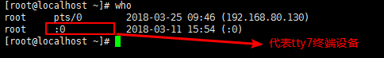
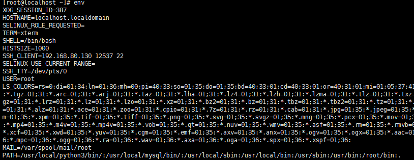

进程管理
=================

命令汇总

- \ ``who``\ 

who
~~~~

\ ``who``\ 命令可以用来查看当前在线用户的情况

每个字段的意义分别是：

- 登陆的用户名
- 使用的设备终端
- 登陆系统的时间

在linux中我们的终端设备有：

- pts设备终端
- tty设备终端

	- tty1~tty6：表示文字界面，在shell下敲\ ``ctrl+alt+[F1-F6]``\ 即可进入对应的文字界面
	- tty7：表示图像界面，在shell下敲\ ``ctrl+alt+F7``\ 即可进入图形界面

ps
~~~~

\ ``ps``\ 命令是用来查看整个系统内部运行进程的相关信息

.. code-block:: sh

	$ps -a        # 列出当前登录终端的进程信息
	$ps -au       # 列出当前登录终端以及对应用户的信息
	$ps -aux      # 列出当前没有对应终端的进程信息，没有终端就意味着不能和用户进行交互

	# ps命令的显示结果一般都很杂乱，不容易找到我们需要的信息，所以ps命令一般通过管道和grep一起使用
	$ps -aux | grep -e "^root.*httpd$" # 查找进程属主为root，进程名为httpd的进程相关信息

kill
~~~~~~

\ ``kill``\ 命令是通过发送信号来杀死运行进程的

.. code-block:: sh

	$kill -l            # 查看当前系统下可以使用的信号
	$kill -SIGKILL 5179 # 使用SIGKILL信号杀死进程号为5179的进程
	$kill -9 4968       # 使用SIGKILL信号杀死进程号为4968的进程，-9对应SIGKILL信号

env
~~~~

\ ``env``\ 命令是用来查看当前进程的环境变量

如上图所示，linux下环境变量的格式是：\ ``key=value``\ 

- \ ``key``\ 一般都是大写的变量
- \ ``value``\ 值可以有多个，每个值之间使用\ ``:``\ 分隔

.. code-block:: sh

	$env | grep PATH  $获取当前进程的PATH环境变量

top
~~~~~

\ ``top``\ 命令可以实时刷新进程的状态信息，类似于windows下面的任务管理器
