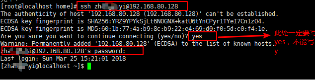

ssh服务器搭建
==============

\ ``ssh服务器``\ 的主要功能就是：远程登录全权操作主机

\ ``ssh服务器的搭建``\ 我们这里选择使用\ ``openssh-server``\ 工具

其搭建基本流程是：

- \ `server工具安装 <#sshl>`_\ 

	- \ `Ubuntu系列安装 <#sshubuntu>`_\ 
	- \ `CentOS系列安装 <#sshcentos>`_\ 
- \ `远程登陆 <#sshclient>`_\ 
- \ `连接操作 <#sshoperation>`_\ 

.. _sshl:

0x00 server工具安装
~~~~~~~~~~~~~~~~~~~~~

不同linux发行版的安装方式不同

.. _sshubuntu: 

Debian/Ubuntu系列安装方式

.. code-block:: sh

	# apt-get安装
	$sudo apt-get install openssh-server

.. _sshcentos: 

RedHat/Fedra/CentOs系列安装方式

.. code-block:: sh
	
	# yum安装
	$yum install openssh-server

.. _sshclient:

0x01 远程登陆
~~~~~~~~~~~~~~~

登录方式很简单：\ ``ssh UserName@ServerIp``\ 

.. _sshoperation:

0x02 连接操作
~~~~~~~~~~~~~~

ssh远程登录后所能做的操作包括远程主机支持的所有本地操作
